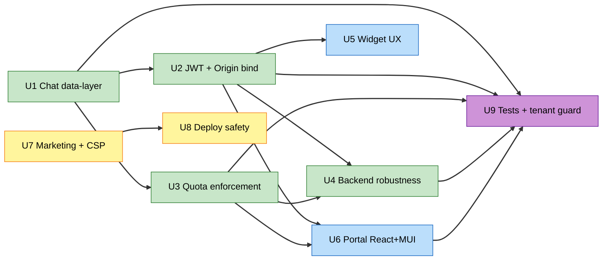

# Unit Dependency Matrix

## Dependency graph

## Matrix

| Unit | Depends on | Reason | Can parallelize with |
|---|---|---|---|
| U1 | — | Foundation: `shared` keys + backend data layer | U7 |
| U2 | U1 | Both touch `shared` (keys + jwt contract); sequence to avoid churn | U7 |
| U3 | U1 | Reads USAGE#/config on the chat path built in U1 | U5, U7 |
| U4 | U2, U3 | Wraps the chat hot path after token + quota are in | U5, U7 |
| U5 | U2 | Widget consumes the hardened token/session contract | U3, U4, U7 |
| U6 | U2, U3 | Portal consumes JWT contract + shows quota copy | U7 |
| U7 | — | Marketing + CSP/design-system; independent of backend units | U1, U2, U3 |
| U8 | U7 | Needs the Edge `ResponseHeadersPolicy`/cache changes from U7 | — |
| U9 | U1, U2, U3, U4, U6 | Tests the behavior those units introduce; tenant guard used by U1–U4 | — |

## Critical path
**U1 → U2 → U4 → U9** (and **U2 → U6 → U9**). U7 → U8 runs as an independent side-chain. The tenant-access guard helper is *introduced* in U1 (as a shared/backend lib) and *enforced* as U1–U4 land; its full negative-assertion test suite is in U9.

## Recommended execution order (linear, gated)
Given single-branch, one-commit-per-unit, unit-by-unit review, the practical linear order is:

**U1 → U2 → U3 → U4 → U5 → U6 → U7 → U8 → U9**

This respects every dependency (each unit's prerequisites precede it) while keeping a simple, reviewable sequence. U7 could move earlier (it's independent of the backend chain) but is placed after the widget/portal so all UI-surface + CSP work clusters together before the deploy-safety unit that depends on it.

## Coordination points
- **`packages/shared`** is touched by U1 (keys), U2 (jwt contract), U6 (schema reuse — read-only). Sequence U1 before U2; U6 only consumes.
- **Chat handler** (`handlers/chat.ts`) is modified by U1, U2, U3, U4 — sequential to avoid merge churn on one file.
- **Edge `ResponseHeadersPolicy`** (U7) must precede the deploy-pipeline cache work (U8).
- **E2E** (`data-testid`, `VITE_E2E`) is a global invariant preserved by U5, U6, and verified in U9.
