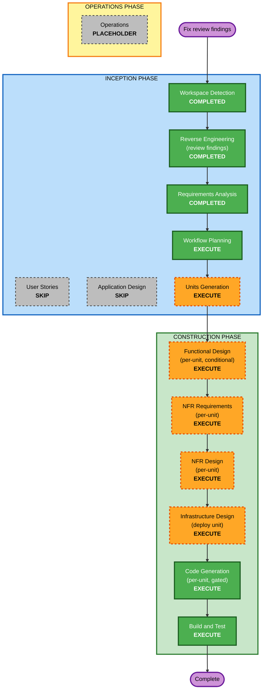

# Execution Plan — Review Findings Remediation

## Detailed Analysis Summary

### Transformation Scope (Brownfield)
- **Transformation Type**: Mixed — bug fixes + security hardening (backend, in place) + one framework migration (portal → React+MUI, within its existing package boundary) + infra/pipeline changes (CDK + GitHub Actions).
- **Primary Changes**: See `requirements.md` FR-1…FR-7.
- **Related Components**: `packages/backend`, `packages/shared`, `packages/widget`, `packages/dashboard` (rewrite), `packages/marketing`, `infra`, `.github/workflows`, `e2e`.

### Change Impact Assessment
- **User-facing changes**: **Yes** — widget UX (close/Esc/retry/links), entire portal rebuilt, marketing CTAs.
- **Structural changes**: **Yes** — portal migrates vanilla→React+MUI; central tenant-access guard added; deploy cache strategy changed.
- **Data model changes**: **Minimal** — message sort-key scheme changes (ULID) for FR-1.2; `messageCount` written for FR-3.8. No table/GSI redefinition (that's deferred Tier 3).
- **API changes**: **No new endpoints**; chat handler adds Origin + quota enforcement; error responses gain CORS headers. Contracts in `packages/shared` extended (JWT claims `kid`/`iss`/`aud`).
- **NFR impact**: **Yes** — security (CSP, token binding, XSS, JWT), cost-safety (quota), resiliency (timeouts, smoke gate), a11y (WCAG AA), testing (chat suite + PBT).

### Component Relationships
- **Primary**: `packages/backend` (most security + correctness fixes), `packages/dashboard` (full rewrite).
- **Shared**: `packages/shared` (JWT contract, zod schemas reused by portal validation, DDB key helpers) — **must update first** where contracts change, since backend + portal both consume it.
- **Infrastructure**: `infra` (CSP/headers, CORS/OIDC, cache split), `.github/workflows` (cache-split sync, smoke gate, OIDC scope).
- **Dependent**: `packages/widget` + `packages/marketing` consume shared + backend behavior.
- **Supporting**: `e2e` (must stay green — preserve `data-testid` + `VITE_E2E`).

### Risk Assessment
- **Risk Level**: **Medium–High** (system-wide; includes a framework migration and security-sensitive backend changes).
- **Rollback Complexity**: **Moderate** — unit-by-unit commits on a feature branch; each unit independently revertible; version-redeploy rollback for infra.
- **Testing Complexity**: **Complex** — new chat-handler suite, PBT, portal component tests, E2E preservation.

## Workflow Visualization

## Phases to Execute

### 🔵 INCEPTION PHASE
- [x] Workspace Detection (COMPLETED)
- [x] Reverse Engineering (COMPLETED — findings captured)
- [x] Requirements Analysis (COMPLETED)
- [x] User Stories (SKIP) — *Rationale*: remediation of a well-specified findings list, not new-feature discovery; no new personas.
- [x] Workflow Planning (IN PROGRESS)
- [ ] Application Design (SKIP) — *Rationale*: no new services/components; the portal is re-implemented within its existing package boundary. Component-level design captured inside the portal unit's Functional Design instead.
- [ ] Units Generation (EXECUTE) — *Rationale*: work spans many packages and decomposes naturally into independent, separately-committable units — the basis for the approved unit-by-unit gated delivery.

### 🟢 CONSTRUCTION PHASE (per unit)
- [ ] Functional Design (EXECUTE, conditional per unit) — for units with real logic/data-model change (chat data-layer, portal, quota).
- [ ] NFR Requirements (EXECUTE, per unit) — security/resiliency/PBT rule mapping per unit; framework selection (fast-check, React+MUI) recorded here.
- [ ] NFR Design (EXECUTE, per unit) — CSP policy, token-binding design, quota design, timeout/degradation patterns.
- [ ] Infrastructure Design (EXECUTE, deploy/infra unit only) — cache-split, OIDC scope, smoke gate.
- [ ] Code Generation (EXECUTE, ALWAYS, per unit) — Part 1 plan + Part 2 generate, gated with tests + reviewer pass + conventional commit + PROGRESS.md.
- [ ] Build and Test (EXECUTE, ALWAYS) — full suite (unit + PBT + E2E + synth) after all units.

### 🟡 OPERATIONS PHASE
- [ ] Operations — PLACEHOLDER.

## Proposed Units of Work (detailed in Units Generation)
Ordered by dependency and severity. Each is one gated commit.

| # | Unit | Findings covered | Packages | Depends on |
|---|---|---|---|---|
| **U1** | Chat data-layer correctness | 0.1, 0.2, 0.4, 2.7(persist), 3.10(enable) | shared (keys), backend | — |
| **U2** | Widget JWT hardening + Origin binding | 1.2, 1.4, 4.7(apiBase) | shared (jwt contract), backend, widget | U1 (shared touched) |
| **U3** | Cost-safety: quota enforcement + auto kill-switch | 1.1, 5.x | backend | U1 |
| **U4** | Backend robustness: CORS-on-errors, fail-closed, timeouts, JSON guards | 2.6, 2.7(ratelimit), 3.8(kill cache), 3.9, 3.13, RESILIENCY-10 | backend | U2, U3 |
| **U5** | Widget UX fixes (vanilla) | 0.3, 4.11–4.17 | widget | U2 |
| **U6** | Portal rebuild → React + MUI (auth stepper, validation, dashboard, sessions) | 1.3, 2.8, 2.9, 4.1–4.10, 4.21–4.23 | dashboard, shared (validation reuse) | U2 (JWT contract), U3 (quota UI copy) |
| **U7** | Marketing fixes + shared CSP/headers + design-system import | 1.5, 2.10, 4.18–4.20, SECURITY-04 | marketing, shared, infra (edge headers) | — |
| **U8** | Deploy pipeline safety | 2.2, 2.3, 2.5, 3.21 | infra, .github/workflows | U7 (edge cache policy) |
| **U9** | Test backfill + PBT + tenant-access guard | 2.1, 2.4, 3.27–3.31, PBT-02/03/07/08/09 | backend, shared, infra tests, e2e | all above |

**Tenant-access guard (FR-4.6 / 2.1)** is implemented in U9's early step but *used* by U1–U4; sequencing note: introduce the guard helper in U1 (shared/backend lib) and enforce it as fixes land, with the full negative-assertion test suite in U9.

## Package Change Sequence (Brownfield)
1. `packages/shared` first whenever a unit changes a contract/key/schema (backend + portal consume it).
2. `packages/backend` (U1–U4).
3. `packages/widget` (U5), `packages/dashboard` (U6), `packages/marketing` + `infra` edge (U7).
4. `infra` + `.github/workflows` (U8).
5. tests across all (U9).

## Estimated Timeline
- **Total units**: 9, each a gated commit with its own design→code→test→review cycle.
- **Duration**: Not time-boxed; paced by your review at each unit gate (your chosen "unit-by-unit, gated" delivery).

## Success Criteria
- **Primary Goal**: All in-scope findings (Tiers 0–2 + all UI) remediated and verified.
- **Key Deliverables**: 9 gated commits; green unit + PBT + E2E suites; clean `cdk synth`; widget still < 30KB gz; updated PROGRESS.md.
- **Quality Gates (per unit)**: tests green · reviewer-subagent pass · extension-compliance summary (SECURITY/RESILIENCY/PBT: compliant/N-A) · conventional commit · PROGRESS.md update · user approval before next unit.
- **Integration Testing**: Full E2E (handshake + money-path) green after U9; `data-testid` + `VITE_E2E` preserved throughout.
- **Operational Readiness**: Post-deploy smoke gate added (U8); lightweight change-record + incident-response docs proposed (U8, per resiliency opt-in).
